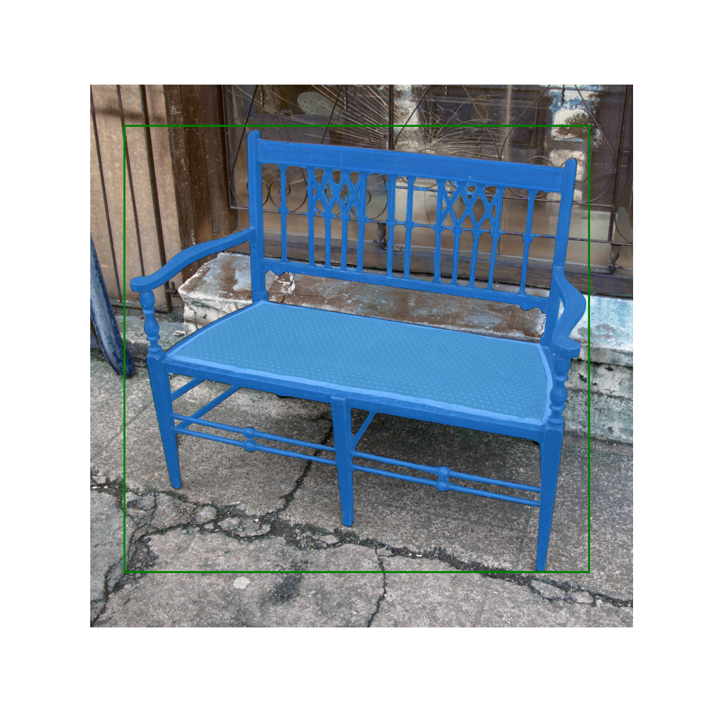
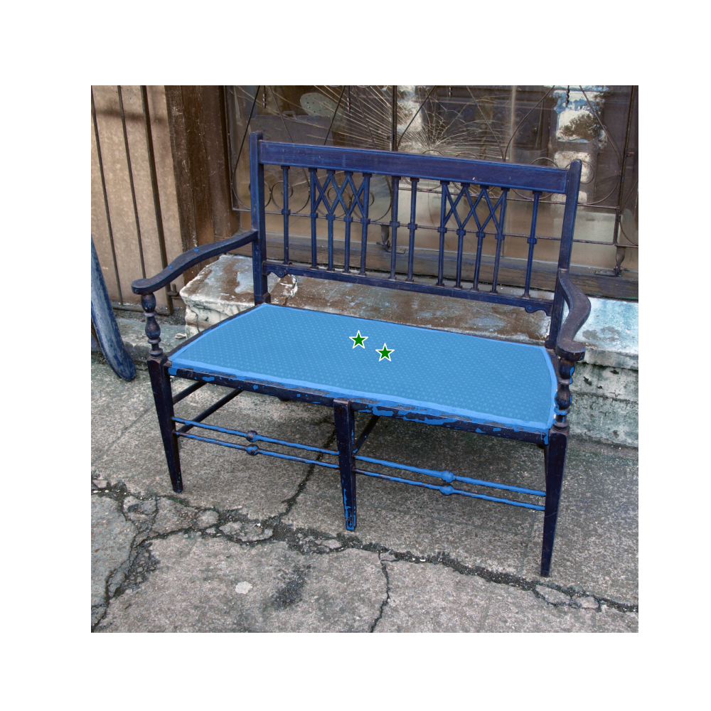

# Segment Anything in High Quality

[](https://paperswithcode.com/sota/zero-shot-segmentation-on-segmentation-in-the?p=segment-anything-in-high-quality)
<a href="https://colab.research.google.com/drive/1QwAbn5hsdqKOD5niuBzuqQX4eLCbNKFL?usp=sharing"></a>
[](https://huggingface.co/spaces/sam-hq-team/sam-hq)
[](https://openxlab.org.cn/apps/detail/keleiwhu/sam-hq)


> [**Segment Anything in High Quality**](https://arxiv.org/abs/2306.01567)           
> NeurIPS 2023  
> ETH Zurich & HKUST

## **ONNX export**
The original SAM's heavy encoder and HQ-SAM's lightweight mask decoder can be exported to ONNX format so that it can be run in any environment that supports ONNX runtime. Export the model with `run.sh`

[Option-1]

You can see the [example notebook](https://colab.research.google.com/drive/11U2La49c2IxahzJkAV-EzPqEH3cz_5hq?usp=sharing) for details on how to combine image preprocessing via HQ-SAM's backbone with mask prediction using the ONNX model. It is recommended to use the latest stable version of PyTorch for ONNX export.

[Option-2]

If you are targeting a deployment scenario, it's recommended refer to the example in `scripts/main.py`. Similarly, you can find the execution command in the `run.sh` script.






Citation
---------------
If you find HQ-SAM useful in your research or refer to the provided baseline results, please star :star: this repository and consider citing :pencil::
```
@article{sam_hq,
    title={Segment Anything in High Quality},
    author={Ke, Lei and Ye, Mingqiao and Danelljan, Martin and Liu, Yifan and Tai, Yu-Wing and Tang, Chi-Keung and Yu, Fisher},
    journal = {arXiv:2306.01567},
    year = {2023}
}  
```